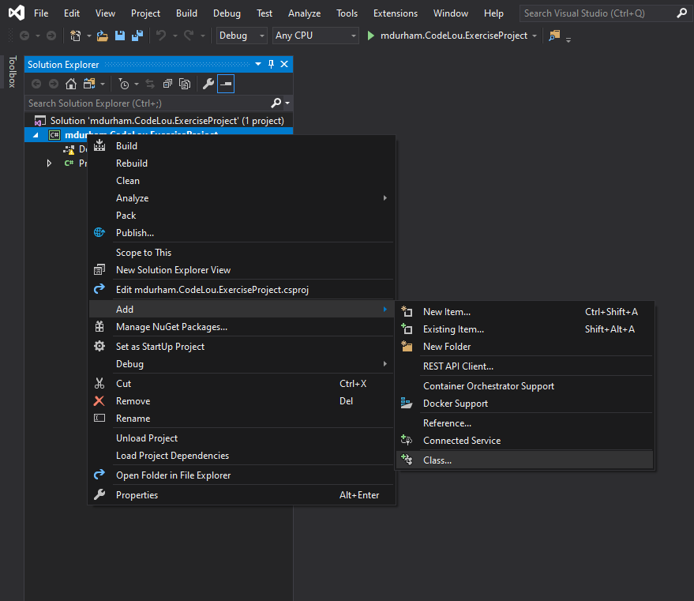
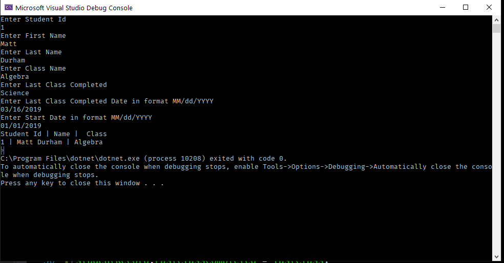

# Overview

Each project builds on the previous, so it's essential that each one is completed successfully.

### Prerequisites

- `Project Fork` - [Download](https://github.com/SamirBanjanovic/SamirBanjanovic.CodeLouisville.CSharp.Projects.Docs.git)
- `.net core sdk` - [Download](https://dotnet.microsoft.com/download/dotnet-core/2.1)
- `Git` - [Download](https://git-scm.com/downloads)
- `Visual Studio` - [Download](https://visualstudio.microsoft.com/vs/community/)
- __Optional__ - A Git UI 
    - GitKraken  - [Download](https://www.gitkraken.com/git-client)
    - GitHub Desktop (macOS, Windows) - [Download](https://desktop.github.com/)

# Project summaries

### Project 1:
- Creating a new `Console` application
- Introduction to `classes`
- Introduction to handling `user input`
- Introduction to `nuget packages`
  - Wonder if need to cover this now?

### Project 2:
- Git branching ??? Super important but how indepth do we need to be?
- User input validation - `?`
- Introduction to `loops`
- Introduction to `Collections`

### Project 3:
- Saving input to a file (json)
- Loading objects from a file (json)
- Updating objects from a file (json)


# Project 1

In this project we will create a simple application that prompts the user for input fields to populate a student object.  When the input is complete we will display the information back to the user. 

- Create a new `Console` application and name it `[YourName].CodeLou.ExerciseProject`

`dotnet new console -n [YourName].CodeLou.ExcerciseProject`

- Create a new `class` and name it `Student` - make sure it's in the `Student.cs` file
- Add the following `properties` to your `Student` class
    - `StudentId` as `int`
    - `FirstName` as `string`
    - `LastName` as `string`
    - `ClassName` as `string`
    - `StartDate` as `DateTimeOffset`
    - `LastClassCompleted` as `string`
    - `LastClassCompletedOn` as `DateTimeOffset`
    - Note for `int` you will need to convert the `Console.ReadLine` input to an `int` using `Convert.ToInt32(Console.ReadLine)`
    - Note for `DateTimeOffset` you will need to conver the `Console.ReadLine` input to a `DateTimeOffset` via `DateTimeOffset.Parse(Console.ReadLine())`

## Creating New Class



## Example Output



## Example Code

```
static void Main(string[] args)
{
    Console.WriteLine("Enter Student Id");
    var studentId = Convert.ToInt32(Console.ReadLine());
    Console.WriteLine("Enter First Name");
    var studentFirstName = Console.ReadLine();
    Console.WriteLine("Enter Last Name");
    var studentLastName = Console.ReadLine();
    Console.WriteLine("Enter Class Name");
    var className = Console.ReadLine();
    Console.WriteLine("Enter Last Class Completed");
    var lastClass = Console.ReadLine();
    Console.WriteLine("Enter Last Class Completed Date in format MM/dd/YYYY");
    var lastCompletedOn = DateTimeOffset.Parse(Console.ReadLine());
    Console.WriteLine("Enter Start Date in format MM/dd/YYYY");
    var startDate = DateTimeOffset.Parse(Console.ReadLine());

    var studentRecord = new Student();
    studentRecord.StudentId = studentId;
    studentRecord.FirstName = studentFirstName;
    studentRecord.LastName = studentLastName;
    studentRecord.ClassName = className;
    studentRecord.StartDate = startDate;
    studentRecord.LastClassCompleted = lastClass;
    studentRecord.LastClassCompletedOn = lastCompletedOn;
    Console.WriteLine($"Student Id | Name |  Class "); ;
    Console.WriteLine($"{studentRecord.StudentId} | {studentRecord.FirstName} {studentRecord.LastName} | {studentRecord.ClassName} "); ;
    Console.ReadKey();

}
```

## Challenge

Add a loop to allow the user to enter new student and display the output. Ask the user if they want to continue at the end of every loop. 
